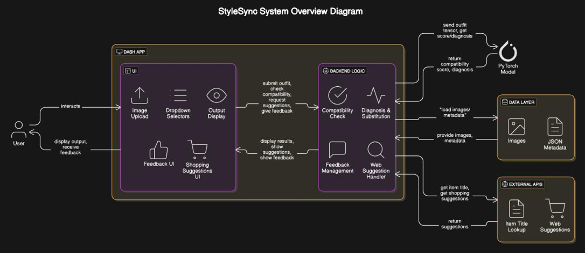
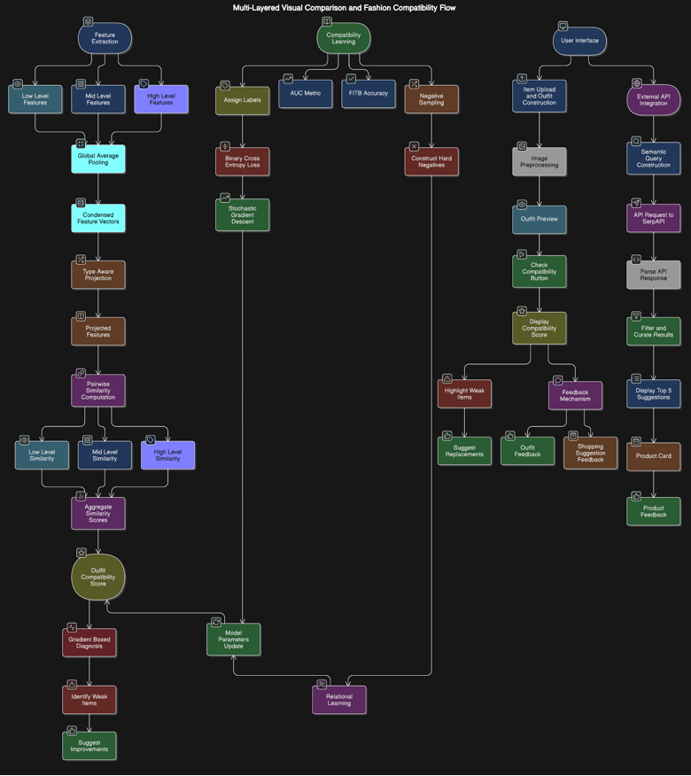
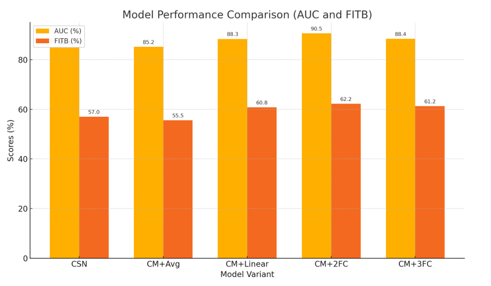
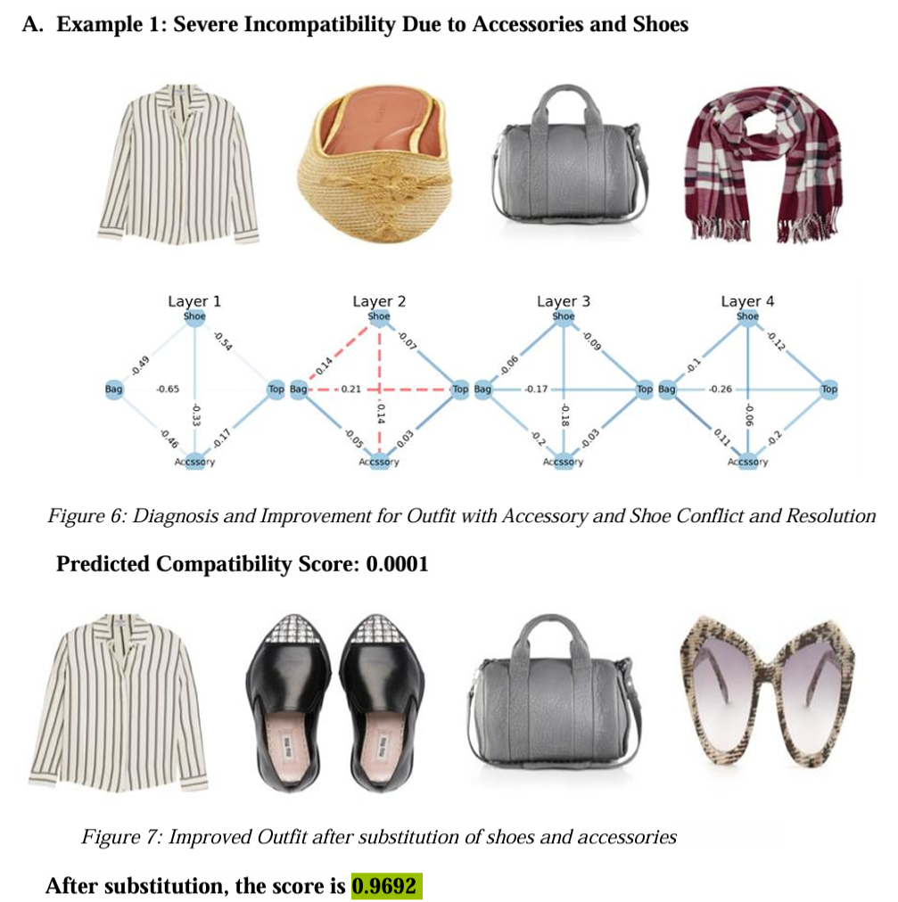
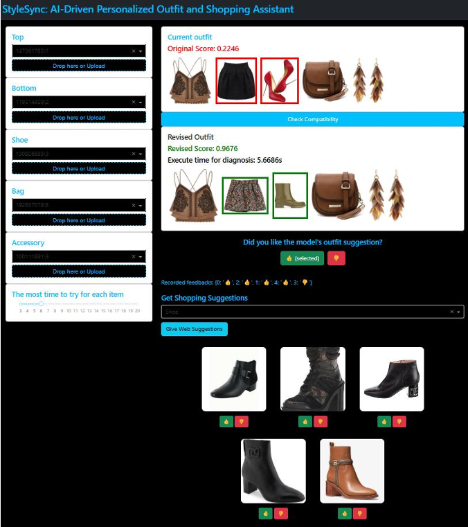

# StyleSync: AI-Driven Personalized Outfit and Shopping Assistant

StyleSync is an **AI-powered fashion recommendation system** that predicts outfit compatibility, diagnoses style mismatches, and provides **real-time shopping suggestions**.  
It combines deep learning–based **visual comparison** with a modern interactive **Dash UI** and **SerpAPI integration** for a complete virtual styling experience.

---

## 📌 Features

- **Outfit Compatibility Prediction**  
  Uses a ResNet-50 + Multi-Layered Comparison Network (MCN) to assess how well items match.
- **Gradient-Based Diagnosis**  
  Identifies specific items that reduce outfit compatibility and suggests replacements.
- **Real-Time Shopping Recommendations**  
  Integrates with SerpAPI to fetch relevant items from live e-commerce sites.
- **Interactive Dash Web App**  
  Dark-themed, responsive UI for uploading outfits, checking compatibility, and browsing suggestions.
- **Feedback Loop**  
  Users can rate both overall compatibility suggestions and individual shopping recommendations.

---

## 🛠 Tech Stack

- **Deep Learning:** PyTorch, ResNet-50, Multi-Layered Comparison Network (MCN)
- **Frontend & Backend:** Dash (Python), Dash Bootstrap Components
- **APIs:** SerpAPI (Google Shopping API)
- **Dataset:** [Maryland Polyvore Images Dataset](https://www.kaggle.com/datasets/dnepozitek/maryland-polyvore-images/data)
- **Evaluation Metrics:** AUC (Area Under ROC), FITB (Fill-in-the-Blank) Accuracy

---

## 📂 Project Architecture

  
*Figure 1: High-level system design showing UI, backend MCN model, feedback loop, and API integration.*

---

## 🔍 Workflow

1. **Image Upload** – Users upload 3–5 clothing items (tops, bottoms, shoes, bags, accessories).  
2. **Feature Extraction** – ResNet-50 extracts multi-level features:  
   - Low-level: texture, color, material  
   - Mid-level: structure, silhouette  
   - High-level: style, theme
3. **Compatibility Scoring** – MCN computes pairwise similarities and aggregates into a score.
4. **Diagnosis** – Gradient-based analysis identifies items causing mismatches.
5. **Shopping Suggestions** – SerpAPI retrieves top 5 relevant products for missing or incompatible categories.
6. **User Feedback** – Ratings are collected for continuous improvement.

  
*Figure 2: End-to-end process flow including feature extraction, compatibility scoring, and diagnosis.*

---

## 📊 Model Performance

  
*Figure 3: AUC and FITB performance across different model configurations and CNN layer combinations.*

Key results:
- **Best Configuration:** CM + 2 Fully Connected Layers
- **AUC:** 91.75% with all CNN layers (4+3+2+1)
- **FITB Accuracy:** 64.25%

---

## 💡 Example: Outfit Diagnosis and Improvement

StyleSync not only scores outfits but also provides actionable styling improvements.

  
*Figure 4: Example where replacing shoes and accessories improved compatibility score from 0.0001 to 0.9692.*

---

## 🛒 Example: Web Recommendations

Shopping suggestions are generated in real-time using SerpAPI.

  
*Figure 5: Real-time shopping suggestions for compatible replacement items, each with clickable links.*

---

## 📑 Detailed Documentation

You can find **in-depth details** about the dataset, methodology, experiments, and results in the following files (included in this repo):

- 📄 [Project Report (PDF)](Project%20Report.pdf)  
- 📊 [Final Presentation (PPTX)](FInal%20StyleSync.pptx)

These documents cover **model architecture, training process, evaluation metrics, case studies, and UI workflows** in much more detail than the README.

---

## 📥 Installation & Running

Follow these steps to set up and run StyleSync locally.

### 1️⃣ Clone the Repository
```bash
git clone https://github.com/<your-username>/StyleSync.git
cd StyleSync
python -m venv venv
source venv/bin/activate   # Mac/Linux
venv\Scripts\activate      # Windows

pip install -r requirements.txt
SERPAPI_KEY=your_serpapi_key
NGROK_AUTHTOKEN=your_ngrok_authtoken
python app/ngrok.py
python app/main.py
